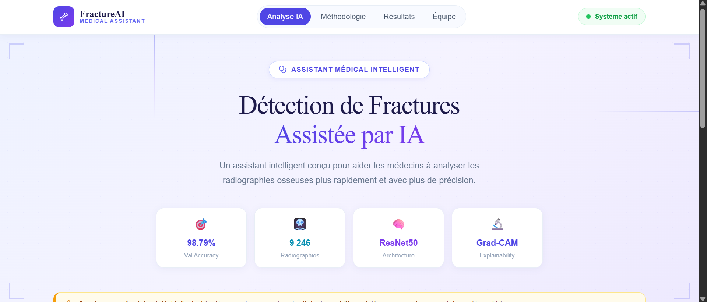
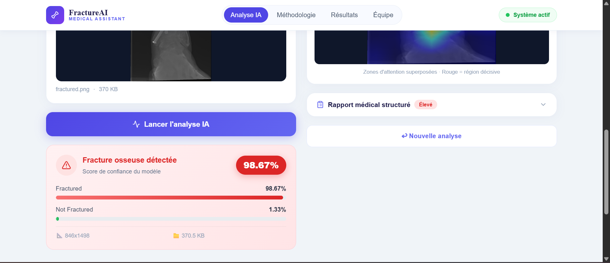

# 🦴 FractureAI — Bone Fracture Detection System

<div align="center">


**Multimodal AI for Bone Fracture Detection and Structured Report**

*Projet Master en Intelligence Artificielle — Faculté des Sciences et Techniques (FST)*

</div>

---

## 👥 Équipe

| Nom | Code |
|-----|------|
| El Kheit Mohamed Babaha | **C21838** |
| Zahra Yeslek Boubecar | **C34645** |

---

## 📋 Description

FractureAI est un système d'aide à la décision médicale basé sur l'intelligence artificielle. Il analyse automatiquement des radiographies osseuses pour :

- ✅ **Détecter** la présence d'une fracture osseuse
- 🔥 **Visualiser** les zones décisives via **Grad-CAM**
- 📋 **Générer** un rapport médical structuré automatiquement

> ⚠️ **Avertissement** : Ce système est un prototype académique. Il ne remplace pas l'expertise d'un médecin qualifié.

---

## 🎯 Résultats

| Métrique | Valeur |
|----------|--------|
| **Val Accuracy** | **98.79%** |
| **AUC-ROC** | **1.000** |
| Époques totales | 17 (10 + 7) |
| GPU | Tesla T4 (Google Colab) |
| Architecture | ResNet50 Transfer Learning |

---

## 🖥️ Interface

### Page d'accueil


### Résultat d'analyse


---

## 📊 Résultats du modèle

### Courbes d'apprentissage


### Matrice de confusion & Courbe ROC


### Visualisations Grad-CAM


### Résumé final Colab


---

## 🏗️ Architecture du projet

```
fracture_project/
├── notebook/
│   └── fracture_detection_training.ipynb   ← Entraînement Google Colab
├── backend/                                 ← API Django REST
│   ├── fracture_api/
│   │   ├── ml_engine.py                    ← ResNet50 + Grad-CAM
│   │   ├── report_generator.py             ← Rapport médical structuré
│   │   ├── views.py                        ← Endpoints API
│   │   └── urls.py
│   ├── predictor/
│   │   └── settings.py
│   ├── model/                              ← Placer fracture_model_final.pth ici
│   ├── manage.py
│   └── requirements.txt
├── frontend/                               ← Interface Next.js
│   └── src/
│       ├── app/
│       │   ├── page.tsx                    ← Interface principale
│       │   └── globals.css
│       └── lib/
│           └── api.ts                      ← Client API
└── docs/
    └── images/                             ← Captures d'écran
```

---

## ⚙️ Stack Technique

| Composant | Technologie |
|-----------|-------------|
| Modèle IA | ResNet50 (Transfer Learning ImageNet) |
| Explainability | Grad-CAM (layer4[-1]) |
| Framework DL | PyTorch 2.7 |
| Backend | Django REST Framework |
| Frontend | Next.js 14 + Tailwind CSS |
| Entraînement | Google Colab T4 GPU |
| Dataset | Fracture Multi-Region X-ray Data (Kaggle) |

---

## 🚀 Installation et Démarrage

### Prérequis
- Python 3.11
- Node.js 18+
- Le fichier `fracture_model_final.pth` (généré après l'entraînement Colab)

### 1. Entraînement du modèle (Google Colab)

```bash
# Ouvrir le notebook dans Google Colab
# notebook/fracture_detection_training.ipynb

# Sélectionner Runtime → Change runtime type → GPU (T4)
# Exécuter toutes les cellules (Ctrl+F9)
# Le modèle est sauvegardé dans Google Drive : fracture_model_final.pth
# Copier le fichier dans : backend/model/fracture_model_final.pth
```

### 2. Backend Django

```bash
# Aller dans le dossier backend
cd backend

# Créer l'environnement virtuel Python 3.11
py -3.11 -m venv venv311
venv311\Scripts\activate          # Windows
# source venv311/bin/activate     # Mac/Linux

# Installer les dépendances
pip install Django djangorestframework django-cors-headers
pip install torch torchvision --index-url https://download.pytorch.org/whl/cu118
pip install timm grad-cam numpy python-dotenv opencv-python-headless scikit-learn Pillow

# Configurer les variables d'environnement
# Créer le fichier backend/.env :
# DJANGO_SECRET_KEY=votre-cle-secrete
# DEBUG=True
# MODEL_PATH=model/fracture_model_final.pth

# Initialiser la base de données
python manage.py migrate

# Lancer le serveur
python manage.py runserver
# ✅ API disponible sur : http://localhost:8000
```

Vérification :
```bash
curl http://localhost:8000/api/health/
# {"status": "ok", "message": "Fracture Detection API is running"}
```

### 3. Frontend Next.js

```bash
# Dans un nouveau terminal
cd frontend

# Installer les dépendances
npm install

# Lancer le serveur de développement
npm run dev
# ✅ Interface disponible sur : http://localhost:3000
```

---

## 🔌 API Endpoints

| Méthode | Endpoint | Description |
|---------|----------|-------------|
| `GET` | `/api/health/` | Vérification de l'état du serveur |
| `POST` | `/api/predict/` | Analyse d'une radiographie |
| `GET` | `/api/model-info/` | Informations sur le modèle |

### Exemple d'appel

```bash
curl -X POST http://localhost:8000/api/predict/ \
  -F "image=@radiographie.jpg"
```

### Structure de la réponse

```json
{
  "success": true,
  "prediction": "fractured",
  "confidence": 98.67,
  "is_fractured": true,
  "probabilities": {
    "fractured": 98.67,
    "not fractured": 1.33
  },
  "gradcam_image": "data:image/png;base64,...",
  "report": {
    "statut": "Fracture détectée",
    "score_confiance": "98.7%",
    "recommandation": "Consultation orthopédique urgente recommandée.",
    "niveau_urgence": "Élevé"
  }
}
```

---

## 🧠 Architecture du Modèle

```
ResNet50 (ImageNet pretrained)
        ↓
  Feature Extraction (backbone gelé — Phase 1)
        ↓
  GlobalAvgPool → vecteur 2048 dimensions
        ↓
  Dropout(0.5)
        ↓
  Linear(2048 → 512) + ReLU
        ↓
  Dropout(0.3)
        ↓
  Linear(512 → 2)
        ↓
  Softmax → [P(fractured), P(not fractured)]
```

### Stratégie d'entraînement en 2 phases

| Phase | Couches actives | LR | Époques |
|-------|----------------|-----|---------|
| Phase 1 | Classifier uniquement | 1e-3 | 10 |
| Phase 2 (Fine-tuning) | layer3 + layer4 + classifier | 1e-5 / 2e-5 / 1e-4 | 7 |

---

## ⚡ Optimisations Appliquées

| # | Optimisation | Impact |
|---|-------------|--------|
| 1 | Transfer Learning ImageNet | Convergence rapide |
| 2 | Entraînement 2 phases | Évite le catastrophic forgetting |
| 3 | Mixed Precision AMP float16 | ×2 plus rapide sur T4 |
| 4 | Class Weights | Gestion du déséquilibre |
| 5 | Label Smoothing (0.1) | Meilleure généralisation |
| 6 | AdamW + Weight Decay | Régularisation L2 |
| 7 | CosineAnnealingLR | Convergence douce |
| 8 | Gradient Clipping | Stabilité numérique |
| 9 | LR Différentiel | Adaptation par couche |
| 10 | Grad-CAM | Explainability visuelle |

---

## 📁 Dataset

**Fracture Multi-Region X-ray Data** — [Kaggle](https://www.kaggle.com/datasets/bmadushanirodrigo/fracture-multi-region-x-ray-data)

| Split | Images | Classes |
|-------|--------|---------|
| Train | 9 246 | fractured / not fractured |
| Val | 829 | fractured / not fractured |
| Test | 506 | fractured / not fractured |

---

## 📄 Rapport

Le rapport scientifique complet est disponible dans `docs/rapport_fracture_ai.pdf`.

---

*Faculté des Sciences et Techniques (FST) · Master Intelligence Artificielle · 2025–2026*
